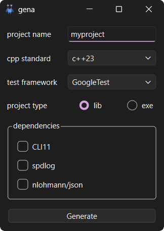

# Gena

A C++ project generator that creates a ready-to-use project skeleton with:

- CMake build system
- Static analysis
- Dynamic analysis
- Extended warning set
- Gitlab CI with test coverage
- Other useful but unobtrusive features (caching, optimizations,  etc.)

## Build

You can build the project using your IDE of choice, or:
```bash
cmake --list-presets
cmake --preset <preset-name>
cmake --build build/<preset-name>
```
Tested on Windows 10/11 and Ubuntu 24.04, but it should work on other Unix-like systems too.

> [!NOTE]
> When building on Windows from the command line, use the x64 Native  
  Tools Command Prompt (or run vcvars64.bat) to ensure a 64-bit toolchain.

> [!TIP]
> If your Qt installation is not in the default system directory, set the `Qt6_ROOT`  
  environment variable to your Qt installation path so CMake can locate it.

## Dependencies
- Qt6.2+
- ccache (recommended)
- cppcheck (developer mode only)
- clang-tidy (developer mode only)

## Usage

After building, you will see something like this:



You can generate either a library or a Qt executable with a GUI.  
The generated project includes all features listed above and  
works out of the box.

It provides a set of CMake presets divided into **developer**  
and **user** mode. Developer mode enables additional options
```cmake
option(MYPROJECT_ENABLE_WARNINGS          "more warnings and werror"  ${MYPROJECT_ENABLE_DEVELOPER_MODE})
option(MYPROJECT_ENABLE_TEST_COVERAGE     "test coverage"             ${MYPROJECT_ENABLE_DEVELOPER_MODE})
option(MYPROJECT_ENABLE_STATIC_ANALYSIS   "clang-tidy, cppcheck"      ${MYPROJECT_ENABLE_DEVELOPER_MODE})
option(MYPROJECT_ENABLE_DYNAMIC_ANALYSIS  "available sanitizers"      ${MYPROJECT_ENABLE_DEVELOPER_MODE})
```

> [!IMPORTANT]
> You are expected to call `<project name>_setup_target` for every  
  target you create. This ensures all features are applied to that target.

> [!TIP]
> You may want to adjust **.clang-tidy** and **.clang-format** to  
  better suit your project. The default configuration is quite strict.

## GitLab runner

The project includes a **.gitlab-ci.yml** file with a simple pipeline that  
builds the project, runs tests, and checks coverage. However, it does not  
create a runner automatically, so you will need to set one up yourself.  
See the official [documentation](https://docs.gitlab.com/runner/install/)
