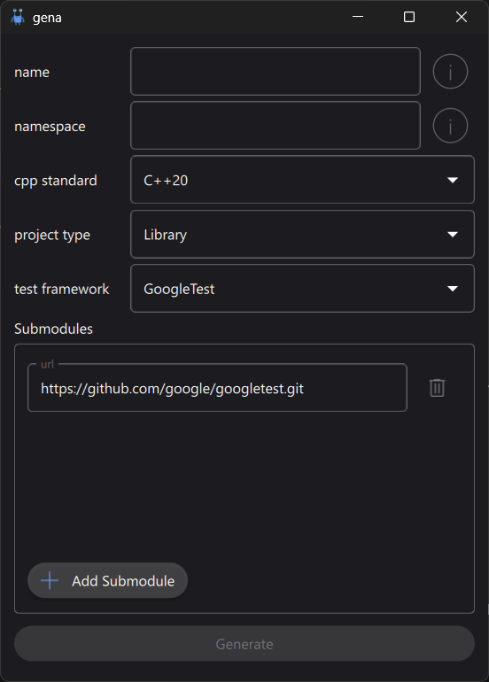

# Gena

A C++ project generator that creates a ready-to-use project skeleton with:

- CMake build system
- Extended warning set
- Gitlab CI with static/dynamic analysis and test coverage
- Other useful but unobtrusive features (caching, hardening, etc.)

## Build

You can build the project using your IDE of choice, or:
```bash
cmake --list-presets
cmake --preset <preset-name>
cmake --build out/build/<preset-name>
```
Tested on Windows 10/11 and Ubuntu 24/26, but it should work on other Unix-like systems too.

## Usage

After building, you will see something like this:



You can generate a library, console application, Qt Widgets application, or Qt Quick application.  
The generated project includes all the features listed above and works out of the box.

> [!NOTE]
> You are expected to call `<project name>_setup_target` for every  
  target you create. This ensures all features are applied to that target.

## GitLab runner

The project includes a **.gitlab-ci.yml** file with a simple pipeline that  
builds the project, runs tests, and checks coverage. However, it does not  
create a runner automatically, so you will need to set one up yourself.  
See the official [documentation](https://docs.gitlab.com/runner/install/)

## Dependencies
- [Qt 6.8+](https://www.qt.io/development/download-qt-installer-oss)
